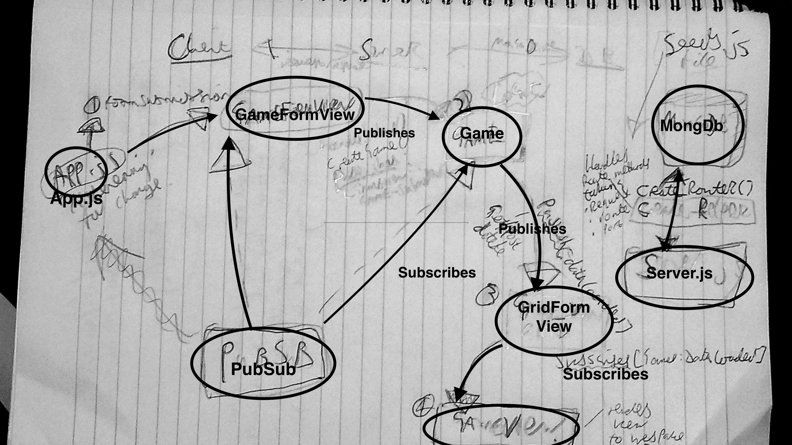

# Homework: Full Stack Games Hub App

### Learning Objectives

- Understand the relationship between client, server and database
- Be able to navigate a codebase that you haven't written

## Brief

Your boss has asked to you look over the codebase of a full-stack JavaScript application. The front-end is written in JavaScript using no frameworks, the back-end uses an Express server and a MongoDB database. Your task is to make yourself familiar with the codebase.

The application includes a README.md with instructions on running the application.

*Overview of the tech stack and tooling with commands*

## MVP

### Task

Draw a diagram showing the dataflow through the application starting with a form submission, ending with the re-rendering of the page. This will involve a multi-direction data-flow with the client posting data to the server and the server sending data back to the client with the response. Detail the client, server and database in the diagram and include the names of the files involved in the process.

## Questions

1. What is responsible for defining the routes of the `games` resource?
- A) the gamesRouter us defining the 'games' resource in server.js using app.use(/api/games')

2. What are the the responsibilities of server.js?
- Server.js is responsible for modularizing/delegating the set of routes associated with Game. ALso responsible for connecting to db and in listening out to the port conn. and passing the collection; to the appropriate method.

3. What are the responsibilities of the `gamesRouter`?
- Receives data and talks to the database and what comes back is full list of the data back to client (games.js) and waits for data to come back from the server before Game publishes . Gives us all the rest-ful routes.

4. What process does the the client (front-end) use to communicate with the server?
- client-server model for that passes requests from client to server which then responds.   Uses HTTP request.

5. What optional second argument does the `fetch` method take? And what is it used for in this application? Hint: See [Using Fetch](https://developer.mozilla.org/en-US/docs/Web/API/Fetch_API/Using_Fetch) on the MDN docs
- It accepts an optional option that is an 'init' object that allows the controlling of different settings inc. headers, method, credentials, cache, referrer.

6. Which of the games API routes does the front-end application consume (i.e. make requests to)? 
- request_helper via games that takes in the url .

7. What are we using the [MongoDB Driver](http://mongodb.github.io/node-mongodb-native/) for?
- the mondoDb driver provides 'callback-based' and 'Promise-based' interaction that allows the database application to take advantage of news ES6 features as well as shared CRUD API spec.

## Extension

Why do we need to use [`ObjectId`](https://mongodb.github.io/node-mongodb-native/api-bson-generated/objectid.html) from the MongoDB driver?
- checks the equality of two ObjectId's, creates in new instance objectid & checks is valid...Allows us more generally to perform methods on the objectID instance itself ...
